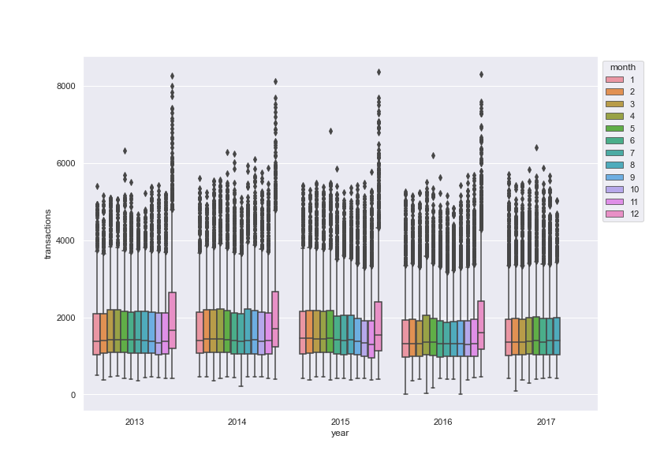
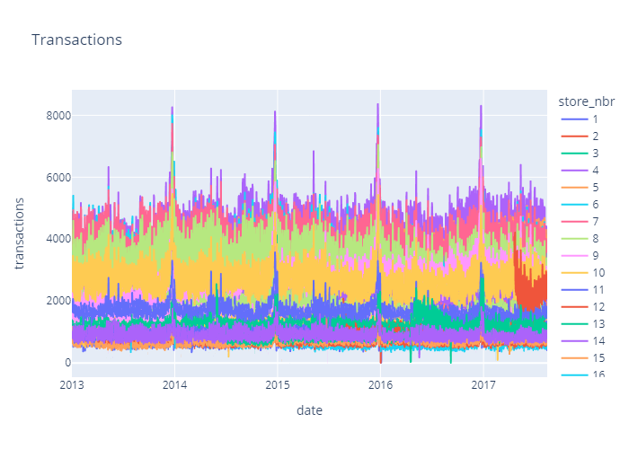
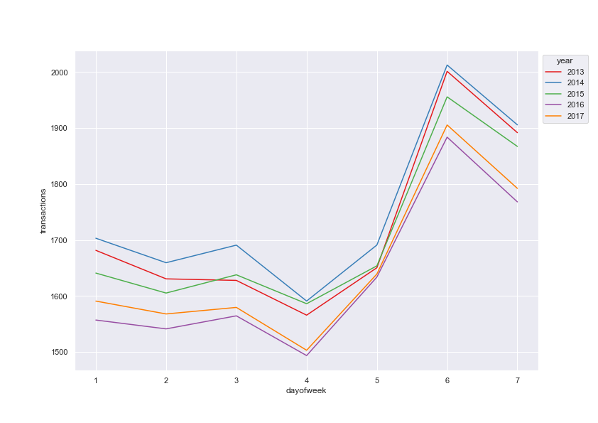
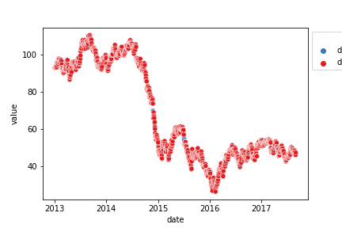
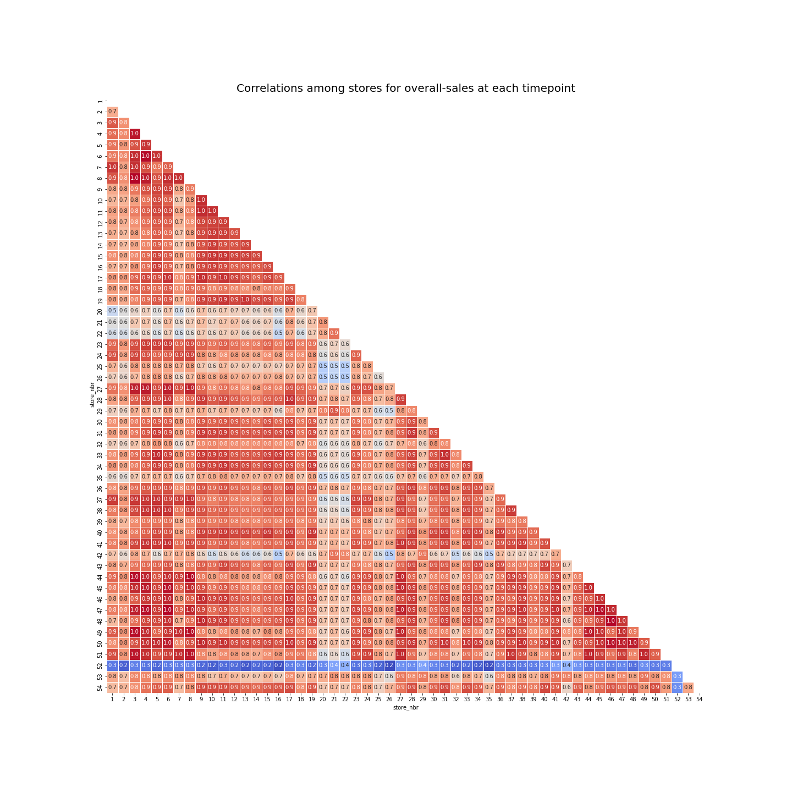

# Learning Optimazation Report

## Guidlines
10-12 pages pdf excluding the title page, the table of contents, and list of references
A written documentation about the project work including:
* a detailed description of the problem
* a description of the data set(s) and data pre-processing
* an introduction to the solution method(s)
* an exact description of the optimization method used
* a discussion of the solutions obtained
* a short presentation of the project work in the beginning of January. The duration of the presentation shall be about 30 minutes.

## Data and Information

The dataset is from a kaggle "getting started" competition on time-series forecasting. The data originates from a large grocery retaile named "Corporación Favorita" from Ecuador. It contains information of 54 stores and 33 prodcut families for the timeperiod of 2013-01-01 to 2017-08-31. The goal is to build a model that predicts the unit sales for each product family and store combination for the next 15 days after the last given timepoint.
The given data consists of the following 6 files:
* Train: contains time series of the stores and the product families combination. The sales column gives the total sales for a product family at a particular store at a given date. Additionally we have the onpromotion colum, which gives the total number of items in a product family that were being promoted at a store at a given date.
* Test: same structure as train. Is used for crossvalidation.
* Store: gives some information about stores such as city, state, type, cluster.
* Transactions: contains the number of total transactions for each store at a given date.
* Holidays and Events: contains information of holidays during the timeperiod. The colums are date,type,locale,locale_name,description and transferred
* Daily Oil Price: contains the oil price at a given date. This is important for predictions as Ecuador is an oil-dependent country and it's economical health is highly vulnerable to shocks in oil prices and thereby also the sales of the grocery retailer.

Additional notes for the challenge are:
* Wages in the public sector are paid every two weeks on the 15 th and on the last day of the month. Supermarket sales could be affected by this.
* A magnitude 7.8 earthquake struck Ecuador on April 16, 2016. People rallied in relief efforts donating water and other first need products which greatly affected supermarket sales for several weeks after the earthquake.

## EDA

### Transactions

There is a stable pattern in the transactions. All months are similar except December from 2013 to 2017 by boxplot. In addition, we've just seen same pattern for each store in previous plot. Store sales had always increased at the end of the year.

 

The days of week is very important for shopping. It shows us a great pattern. Stores make more transactions at weekends. Almost, the patterns are same from 2013 to 2017 and Saturday is the most important day for shopping.

### Oil Price

There are some missing data points in the daily oil data as you can see below. You can treat the data by using various imputation methods. However, I chose a simple solution for that. Linear Interpolation is suitable for this time serie. You can see the trend and predict missing data points, when you look at a time serie plot of oil price.

### Sales

Our main objective is, predicting store sales for each product family. For this reason, sales column should be examined more seriously. We need to learn everthing such as seasonality, trends, anomalies, similarities with other time series and so on.

Most of the stores are similar to each other, when we examine them with correlation matrix. Some stores, such as 20, 21, 22, and 52 may be a little different.

