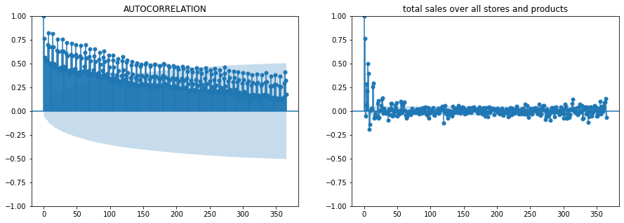
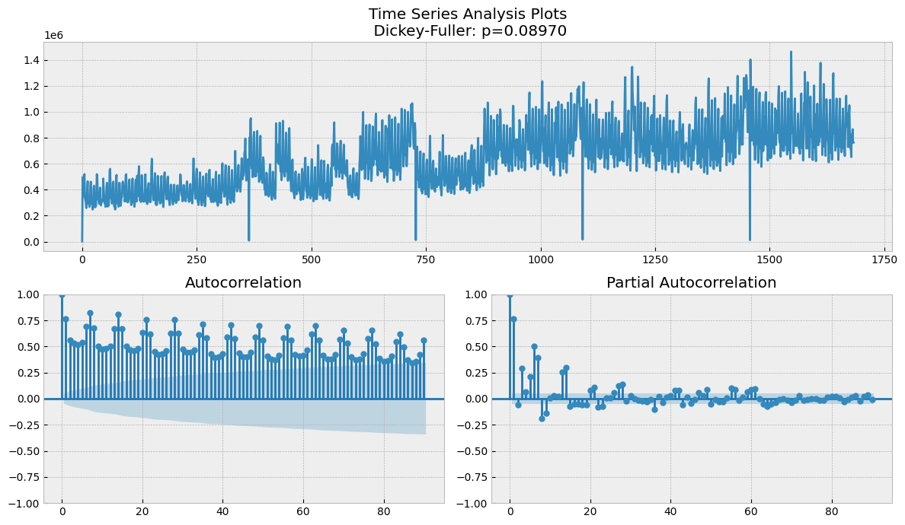
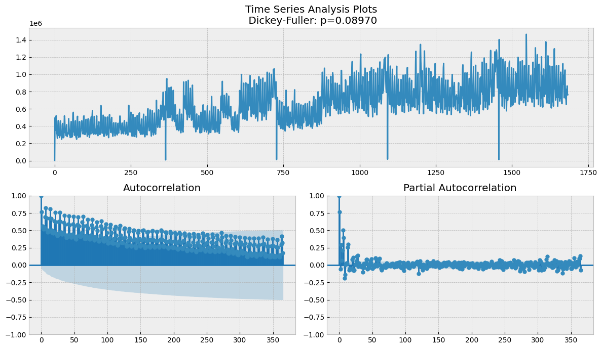

Learning Optimazation Report
==============
***Store Sales - Time Series Forecasting***

**Author:** *Tassilo Henninger* and *Conor Fallon*

# Guidlines
10-12 pages pdf excluding the title page, the table of contents, and list of references
A written documentation about the project work including:
* a detailed description of the problem
* a description of the data set(s) and data pre-processing
* an introduction to the solution method(s)
* an exact description of the optimization method used
* a discussion of the solutions obtained
* a short presentation of the project work in the beginning of January. The duration of the presentation shall be about 30 minutes.

# Data and Information

The dataset is from a kaggle "getting started" competition on time-series forecasting. The data originates from a large grocery retaile named "Corporación Favorita" from Ecuador. It contains information of 54 stores and 33 prodcut families for the timeperiod of 2013-01-01 to 2017-08-31. The goal is to build a model that predicts the unit sales for each product family and store combination for the next 15 days after the last given timepoint.
The given data consists of the following 6 files:
* Train: contains time series of the stores and the product families combination. The sales column gives the total sales for a product family at a particular store at a given date. Additionally we have the onpromotion colum, which gives the total number of items in a product family that were being promoted at a store at a given date.
* Test: same structure as train. Is used for crossvalidation.
* Store: gives some information about stores such as city, state, type, cluster.
* Transactions: contains the number of total transactions for each store at a given date.
* Holidays and Events: contains information of holidays during the timeperiod. The colums are date,type,locale,locale_name,description and transferred
* Daily Oil Price: contains the oil price at a given date. This is important for predictions as Ecuador is an oil-dependent country and it's economical health is highly vulnerable to shocks in oil prices and thereby also the sales of the grocery retailer.

Additional notes for the challenge are:
* Wages in the public sector are paid every two weeks on the 15 th and on the last day of the month. Supermarket sales could be affected by this.
* A magnitude 7.8 earthquake struck Ecuador on April 16, 2016. People rallied in relief efforts donating water and other first need products which greatly affected supermarket sales for several weeks after the earthquake.

# EDA

## Transactions

There is a stable pattern in the transactions. All months are similar except December from 2013 to 2017 by boxplot. In addition, we've just seen same pattern for each store in previous plot. Store sales had always increased at the end of the year.

 

The days of week is very important for shopping. It shows us a great pattern. Stores make more transactions at weekends. Almost, the patterns are same from 2013 to 2017 and Saturday is the most important day for shopping.

## Oil Price

There are some missing data points in the daily oil data as you can see below. You can treat the data by using various imputation methods. However, I chose a simple solution for that. Linear Interpolation is suitable for this time serie. You can see the trend and predict missing data points, when you look at a time serie plot of oil price.

## Sales

Our main objective is, predicting store sales for each product family. For this reason, sales column should be examined more seriously. We need to learn everthing such as seasonality, trends, anomalies, similarities with other time series and so on.

Most of the stores are similar to each other, when we examine them with correlation matrix. Some stores, such as 20, 21, 22, and 52 may be a little different.

### Time Plots

explain drops (earthquake, how to handle the outliers)

The drops in the following graphs are all from the day after new year's eve. This is always the day with the lowest overall sales.

    train = train.groupby("Date").sales.sum().reset_index()
    train[train["sales"] <= 100000]

| date| sales | 
| --- | --- |
| 2013-01-01 | 2511.62 |
| 2014-01-01 | 8602.07 |
| 2015-01-01 | 12773.62 |
| 2016-01-01 | 16433.39 |
| 2017-01-01 | 12082.50 |

### Seasonal plots for sales over month
A seasonal plot is similar to a time plot except that the data are plotted against the individual “seasons” in which the data were observed.

At the end of the year we can see an increase in sales over all years

### scatter plots
see is there correlation between two features.

We see a positive correlation between onpromotion and total sales. A bigger onpromotion value (mean per day over all products and stores) leads to a higher sales value. 

### autocorrelation, how is timeseries correlated to its lags

Just as correlation measures the extent of a linear relationship between two variables, autocorrelation measures the linear relationship between lagged values of a time series. The lag features means,shifting a time serie forward one step or more than one. So, a lag feature can use in the model to improve it. 
However, how many lag features should be inside the model? For understanding that, we can use ACF and PACF. 

Seasonality:
We see can clearly see a 7 lag period, which corresponds to week. That was already expected, but good to have a conformation.

Stationarity is an important characteristic of time series. A time series is said to be stationary if its statistical properties do not change over time. In other words, it has constant mean and variance, and covariance is independent of time. We can run the Dickey-Fuller statistical test to determine if a time series is stationary or not. The Dickey-Fuller tests if a unit root is present. As the p value is at 0.089 and bigger than 5%, the process is not stationary.

Next we see the ACF and PACF for the whole timeperiod.

Next we see the ACF and PACF for 7 days.

Next we see the ACF and PACF for 30 days.
We can see the weekly structure and slight downtrend.

Next we see the ACF and PACF for 90 days.
We can see downtrend in correlation for lags in the past.

Next we see the ACF and PACF for 365 days.

### STL decomposition (univariate) 
, trend, season, reminder. reminder should be white noise, shouldnt be trend, if pattern, there must be some feature which influences our data.

# Forecasting

## Zero Forecasting

Some stores don't sell some product families. Thereby it isn't difficult to forecast them next 15 days. Their forecasts must be 0 next 15 days.

I will remove them from the data and create a new data frame for product families which never sell. Then, when we are at submission part, I will combine that data frame with our predictions.

## Baseline model - Exponential Smoothing

We start of with a baseline model. The naive forecast would be using the last value or a moving average. What we choose as a basline is the simple univariate model exponential smoothing.

Is ist addative or multuplicative?
Needs to be decided based on the seasonality. If the variation of the seasonality is constant, then additive, otherwise multuplicative

think it is multiplicative:

'The additive decomposition is the most appropriate if the magnitude of the seasonal fluctuations, or the variation around the trend-cycle, does not vary with the level of the time series. When the variation in the seasonal pattern, or the variation around the trend-cycle, appears to be proportional to the level of the time series, then a multiplicative decomposition is more appropriate. Multiplicative decompositions are common with economic time series.'

Source: https://otexts.com/fpp2/components.html

Can ask her on Wednesday as well

### Double Exponential Smoothing
Double exponential smoothing is used when there is a trend in the time series. In that case, we use this technique, which is simply a recursive use of exponential smoothing twice.

### Datapreprocessing

For the earthquake :
we can add a boolean as a regressor for the more complex ones
for the univaiate ones we can simply impute the timeframe by pedicting the values by creating a model up to this point

## SARIMA mode

The autocorrelation for an observation and an observation at a prior time step is comprised of both the direct correlation and indirect correlations. These indirect correlations are a linear function of the correlation of the observation, with observations at intervening time steps. It is these indirect correlations that the partial autocorrelation function seeks to remove.
To find it, we look at the partial autocorrelation plot and identify the lag after which most lags are not significant.

For modeling the SARIM-model we first have the autoregression model AR(p). This is basically a regression of the time series onto itself. Here, we assume that the current value depends on its previous values with some lag. It takes a parameter p which represents the maximum lag. To find it, we look at the partial autocorrelation plot and identify the lag after which most lags are not significant.

Choose 14?

After, we add the order of integration I(d). The parameter d represents the number of differences required to make the series stationary.

Finally, we add the final component: seasonality S(P, D, Q, s), where s is simply the season’s length. Furthermore, this component requires the parameters P and Q which are the same as p and q, but for the seasonal component. Finally, D is the order of seasonal integration representing the number of differences required to remove seasonality from the series.

Combining all, we get the SARIMA(p, d, q)(P, D, Q, s) model.

The main takeaway is: before modelling with SARIMA, we must apply transformations to our time series to remove seasonality and any non-stationary behaviors.

https://towardsdatascience.com/the-complete-guide-to-time-series-analysis-and-forecasting-70d476bfe775

## complex multivariate model - Prophet
Prophet is from facebook
you can add holiday events
coeffiicents are interpretal as well

For the earthquake :
we can add a boolean as a regressor for the more complex ones

### Holiday dataset

What are the problems with the given dataset:

Some national holidays have been transferred.
There might be a few holidays in one day. When we merged all of data, number of rows might increase. We don't want duplicates.
What is the scope of holidays? It can be regional or national or local. You need to split them by the scope.
Work day issue
Some specific events
Creating new features etc.
End of the section, they won't be a problem anymore!

# Model Comparisson
dont base evaluation on only one metric. Use multiple ones