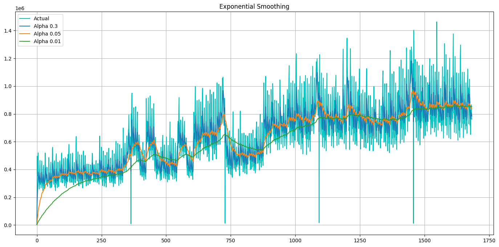
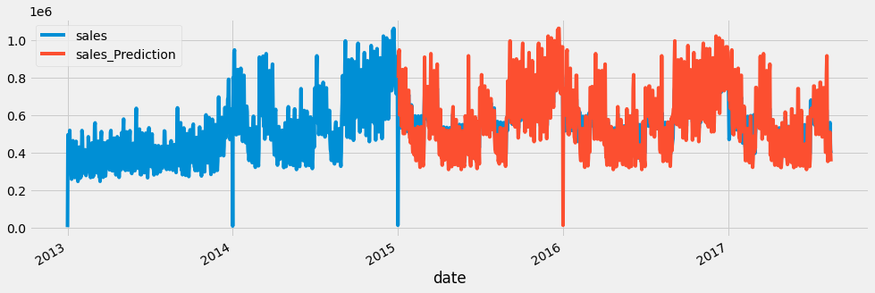

Learning Optimazation Report
==============
***Store Sales - Time Series Forecasting***

**Author:** *Tassilo Henninger* and *Conor Fallon*

# Guidlines
10-12 pages pdf excluding the title page, the table of contents, and list of references
* **remove guidlines before submitting.** 

# Project Goal and Outline

**write text covering the following points** 
* a detailed description of the problem
* an introduction to the solution method(s)
    * what methods did we use
* our outline
    * split the train set into train and validation data
    * use the train data to train the different algorithms. We predict the overall sales of a day over all products and stores.
    * use the validation data to create the validation error and compare the model performances
    * the best model is then picked and a top down approach is done to distribute the overall sales predictions to the products and store combination.
    * submit our results to kaggle and Evaluate the performance
* Discussion and futur work 

Our tactic for model selection is as follows: simply compare the below models with the aforementioned baseline models, predicting solely on the date and ignoring the family and store categories (i.e. we will group by date). The assumption here is that the model that performs best under this simplified process will also perform better when the family and store categories are taken into account. 

This is a 'top-down' approach to this type of forecasting. We will rely on the distribution of the sales amongst the stores and families in the train dataset as our basis for how to divide up the sales that occur on a given day to the various stores and families. This will be how we make our final prediction for each id in the test set.

Our metric for selection, as per the instructions in the kaggle competition, is the Root Mean Squared Logarithmic Error (RMSLE).

# Data and Information

The dataset is from a kaggle "getting started" competition on time-series forecasting. The data originates from a large grocery retaile named "Corporación Favorita" from Ecuador. It contains information of 54 stores and 33 product families for the timeperiod of 2013-01-01 to 2017-08-31. The goal is to build a model that predicts the unit sales for each product family and store combination for the next 15 days after the last given timepoint.
The given data consists of the following 6 files:
* Train: contains time series of the stores and the product families combination. The sales column gives the total sales for a product family at a particular store at a given date. Additionally we have the onpromotion column, which gives the total number of items in a product family that were being promoted at a store at a given date.
* Test: same structure as train, except without the 'sales' value - this is what we have to predict with our model. A prediciton will be made for the 15 days after the end of the train set.
* Store: gives some information about stores such as city, state, type, cluster.
* Transactions: contains the number of total transactions for each store at a given date.
* Holidays and Events: contains information of holidays during the timeperiod. The columns are date,type,locale,locale_name,description and transferred
* Daily Oil Price: contains the oil price at a given date. This is important for predictions as Ecuador is an oil-dependent country and it's economical health is highly vulnerable to shocks in oil prices and thereby also the sales of the grocery retailer.

Additional notes for the challenge are:
* Wages in the public sector are paid every two weeks on the 15th and on the last day of the month. Supermarket sales could be affected by this.
* A magnitude 7.8 earthquake struck Ecuador on April 16, 2016. People rallied in relief efforts donating water and other needed products which greatly affected supermarket sales for several weeks after the earthquake.

## Preprocessing

The preprocessing we done is mainly restricted to the train, test and the holidays and events data. The first thing we done is splitting the train data into a taining and validation set. The Training data will be used for training, the validation data will be used for model comparison. We then aggregated the train, validation and test set by date over all stores and product families to get the overall sales at a given date. We used that datastructure for all of the follwing models: Exponential Smoothing, Double Exponential Smoothing, SARIMA and Random Forest. 

For the Prophet model we additonally used the holidays and events data as well as the on-promotion feature. The holidays and events data needed quite some preprocessing as some national holidays have been transferred and it needs to be accounted for that. Additonally there are regional and local events and holidays which make it even more complicated. As we havent used the regional feature we decided to only include the national events and holdays as they apply for the whole contry and therefore all stores.

# EDA

**reevaluate what to cover, after model comparisson. we can easily leave some stuff out** 

## Transactions

There is a stable pattern in the transactions. All months are similar except December from 2013 to 2017 by boxplot. In addition, we've just seen same pattern for each store in previous plot. Store sales had always increased at the end of the year.

 

The days of week are very important for shopping; there is a strong pattern visible as per the below visualisation. More transactions are made at the weekend. Also, the patterns are relatively consistent from 2013 to 2017, and Saturday is clearly the most important day for shopping.

## Oil Price

There are some missing data points in the daily oil data as you can see below. There are a number of ways that the missing data can be imputed, with the scikit-learn package having several easy-to-implement solutions. However, a simple solution was chosen in this case. Linear Interpolation is suitable for this time series; one can see the trend and predict the missing data points when looking at a time series plot of oil price.

## Sales

Our main objective is to predict store sales for each product family and at each store. For this reason, sales column should be examined more closely. Things such as seasonality, trends, anomalies, similarities with other time series and so on, should be observed and be taken into account where relevant.

By examining the correlation matrix, we can see that most of the stores are similar to each other. Some stores, however, such as 20, 21, 22, and 52, may be a little different.

### Time Plots

explain drops (earthquake, how to handle the outliers)

The drops in the following graphs are all from the day after New Year's Eve. This is always the day with the lowest overall sales. This is perhaps unsurprising as many of the shops will be closed on New Year's Day.

    train = train.groupby("Date").sales.sum().reset_index()
    train[train["sales"] <= 100000]

| date| sales | 
| --- | --- |
| 2013-01-01 | 2511.62 |
| 2014-01-01 | 8602.07 |
| 2015-01-01 | 12773.62 |
| 2016-01-01 | 16433.39 |
| 2017-01-01 | 12082.50 |

### Seasonal plots for sales over month
A seasonal plot is similar to a time plot except that the data are plotted against the individual “seasons” in which the data were observed.

At the end of the year we can see an increase in sales over all years, which is reflective of an increasing trend overall. In our later use of econometrics models, this will motivate our use of multiplicative models instead of additive models, as these are more suitable to situations where the range between successive periods is increasing.

### scatter plots
see is there correlation between two features.

We see a positive correlation between onpromotion and total sales. A bigger onpromotion value (mean per day over all products and stores) leads to a higher sales value. 

### Autocorrelation - How are timeseries correlated to their lags?

Just as correlation measures the extent of a linear relationship between two variables, autocorrelation measures the linear relationship between lagged values of a time series. The lag features means shifting a time series forward one step or more than one. This autocorrelation for an observation and an observation at a prior time step is comprised of both the direct correlation and indirect correlations. These indirect correlations are a linear function of the correlation of the observation, with observations at intervening time steps. The partial autocorrelation function removes those indirect correlations.

To better understand the data we can use the autocorrelation function (ACF) and partial autocorrelation function (PACF) and identify the siginificant lag features, that we should include into the model. We see can clearly see a 7 lag period in the ACF, which corresponds to a weekly periodicity. That was already expected, but it is good to have some statistical backing. The PACF shows a bigger partial autocorrelation for the 1,6 and 7 lags. Those lags could be interesting to includ in the model.

Additionnally we also check the timeseries for stationarity. A time series is said to be stationary if its statistical properties do not change over time. In other words, it has constant mean and variance, and covariance is independent of time. We run the Dickey-Fuller statistical test to determine if a time series is stationary or not. The Dickey-Fuller-Test tests if a unit root is present. As the p value is at 0.0897 and bigger than 5%, we can not reject the nullhypothesis, and therefore have to assume that the process is not stationary.

### STL decomposition (univariate) 
**explain STL decomposition** 

, trend, season, reminder. reminder should be white noise, shouldnt be trend, if pattern, there must be some feature which influences our data.

# Forecasting
In the following chapter we applied the models introduced in the outline. We trained each model on the training data and evaluated it based on the evaluation set. For each forcasting method we give a detailed explanation how it works and share the optained metric results. 

## Baseline model - Exponential Smoothing

We start of with a baseline model. The naive forecast would be using the last value or a moving average. What we choose as a basline is the simple univariate model exponential smoothing.

**Explanation of Exponential Smoothing**

Is ist addative or multuplicative?
Needs to be decided based on the seasonality. If the variation of the seasonality is constant, then additive, otherwise multuplicative

think it is multiplicative:

'The additive decomposition is the most appropriate if the magnitude of the seasonal fluctuations, or the variation around the trend-cycle, does not vary with the level of the time series. When the variation in the seasonal pattern, or the variation around the trend-cycle, appears to be proportional to the level of the time series, then a multiplicative decomposition is more appropriate. Multiplicative decompositions are common with economic time series.'

------------------------------  
As mentioned already, the fact that the magnitude of the seasonal fluctuations changes with regard to the level of the time series is indicative of us needing to use a multiplicative time series model.

Source: https://otexts.com/fpp2/components.html

Can ask her on Wednesday as well

## Double Exponential Smoothing
**Explanation of Double Exponential Smoothing**

Double exponential smoothing is used when there is a trend in the time series. In that case, we use this technique, which is simply a recursive use of exponential smoothing twice.

## SARIMA model

The SARIMA model acronym stands for "Seasonal Auto-Regressive Integrated Moving Average". 

The "autoregressive" (AR) component of the model is represented by AR(p), with the p parameter determining the number of lagged series that we use. **As we found out in the ACF and PACF (chapter "Autocorrelation"), the first 7 lags, particular lag 1,6 and 7 are interesting for that**. After the first 7 lags it repeats itslef and the lags are not significant anymore. The "integrated" (I) is the difference order, which is the number of transformations (d) needed to make the data stationary. The parameter d represents the number of differences required to make the series stationary. As we have found out in chapter "Autocorrelation" that we have to assume non-stationary for our series, that comes in handy. The "moving mverage" (MA) is the moving average model with its parameter q as the number of included error lags. In an MA(1) model, our forecast is a constant term plus the previous error times a multiplier, added with the current error. The "Seasonal" (S) component extends the ARIMA model with an additional set of autoregressive and moving average components with the parameters S(P, D, Q, s). The parameters P and Q are the same as p and q, but now for the seasonal component. D is again the order of seasonal integration representing the number of differences required to make the series stationary. And Finally, s which is simply the season’s length.
Combining all, we get the SARIMA(p, d, q)(P, D, Q, s) model.

We played around with the parameters and found the best solution with the following settings.
**Settings**
The performance on the vaildation data is given in the following table: 

## Prophet

The Prophet algorithm was introduced by [Sean J. Taylor and Ben Letham](https://peerj.com/preprints/3190.pdf) from Facebook in 2017. It is designed to be easy and completely automatic. 
> ["It implements a procedure for forecasting time series data based on an additive model where non-linear trends are fit with yearly, weekly, and daily seasonality, plus holiday effects."](https://cran.r-project.org/web/packages/prophet/prophet.pdf)

Based on the additive model, we are also able to add regressors which coefficents can be interpreted as in the SARIMAX model. 

We traine three different versions of the Prophet model. First we fit only on the training data. Next we added the preprocessed national holidays and events information as two different holiday types. For the third model we added the "on-promotion" feature as an additional regressor. The performance on the vaildation data of the three models is given in the following table: 

## Random Forest

**explain Random Forest** 

Our other candidate is the random forest. This model is optimised using a simple Grid Search with Cross Validation for hyperparameter optimisation. It produces a RMSLE of 0.27416784190891913 and from a superficial glance, it produces a nice prediciton plot:

# Model Comparisson
dont base evaluation on only one metric. Use multiple ones, but also the one from the competition.
* Root Mean Squared Logarithmic Error (RMSLE)
* ...

**discussion of the solutions obtained** 

## Distribution for Top-Down Approach

There are 54 stores and 33 families which leads to 1782 possible combinations of the two being produced. The proportion of sales for each of these combinations has been found and this will be applied to the 'bottom' part of our approach to help us figure out how the sales on a given predicted day ought to be divided up. The distribution for each of the stores and familes can be inspected below.

**maybe only the last couple of weeks? read paragraph below** 
The proportions are quite stable over time, therefore we'll use the last week of available data to calculate proportions over that week and repeat that weekly pattern to forecast the future proportions. It's a big assumption but acceptable for what we are trying to do.

Note, we found that out that some stores don't sell some product families during EDA. This is also covered by the top-down approach.

# Future Work and Discussion 
**write chapter**

Further points to improve. Reference points we noticed during EDA. e.g.:

* stores 20, 21, 22, and 52, may be a little different.
* havent used the oil price data. countrys economy is really dependent on oil price
* Transactions havent used
* havent used information about Wages in the public sector are paid every two weeks on the 15th and on the last day of the month. Supermarket sales could be affected by this.
* havent taken into acount the earthquake