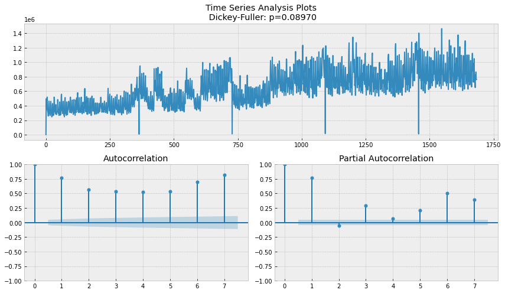
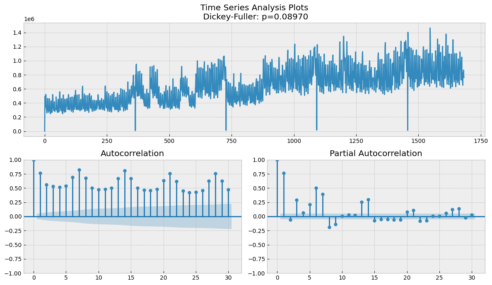
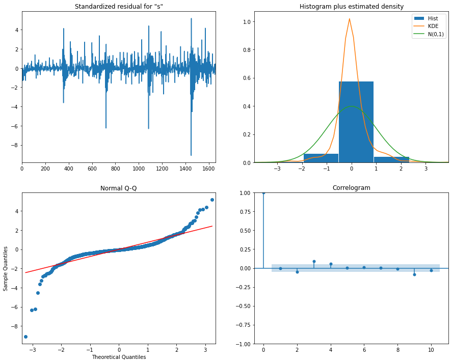
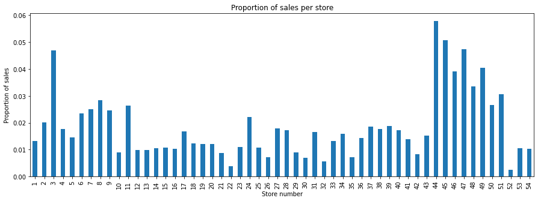

Learning Optimazation Report
==============
***Store Sales - Time Series Forecasting***

**Author:** *Tassilo Henninger* and *Conor Fallon*

# Guidlines
10-12 pages pdf excluding the title page, the table of contents, and list of references
A written documentation about the project work including:
* a detailed description of the problem
* a description of the data set(s) and data pre-processing
* an introduction to the solution method(s)
* an exact description of the optimization method used
* a discussion of the solutions obtained
* a short presentation of the project work in the beginning of January. The duration of the presentation shall be about 30 minutes.

# Data and Information

The dataset is from a kaggle "getting started" competition on time-series forecasting. The data originates from a large grocery retaile named "Corporación Favorita" from Ecuador. It contains information of 54 stores and 33 product families for the timeperiod of 2013-01-01 to 2017-08-31. The goal is to build a model that predicts the unit sales for each product family and store combination for the next 15 days after the last given timepoint.
The given data consists of the following 6 files:
* Train: contains time series of the stores and the product families combination. The sales column gives the total sales for a product family at a particular store at a given date. Additionally we have the onpromotion column, which gives the total number of items in a product family that were being promoted at a store at a given date.
* Test: same structure as train, except without the 'sales' value - this is what we have to predict with our model. A prediciton will be made for the 15 days after the end of the train set.
* Store: gives some information about stores such as city, state, type, cluster.
* Transactions: contains the number of total transactions for each store at a given date.
* Holidays and Events: contains information of holidays during the timeperiod. The columns are date,type,locale,locale_name,description and transferred
* Daily Oil Price: contains the oil price at a given date. This is important for predictions as Ecuador is an oil-dependent country and it's economical health is highly vulnerable to shocks in oil prices and thereby also the sales of the grocery retailer.

Additional notes for the challenge are:
* Wages in the public sector are paid every two weeks on the 15th and on the last day of the month. Supermarket sales could be affected by this.
* A magnitude 7.8 earthquake struck Ecuador on April 16, 2016. People rallied in relief efforts donating water and other needed products which greatly affected supermarket sales for several weeks after the earthquake.

# EDA

## Transactions

There is a stable pattern in the transactions. All months are similar except December from 2013 to 2017 by boxplot. In addition, we've just seen same pattern for each store in previous plot. Store sales had always increased at the end of the year.

 

The days of week are very important for shopping; there is a strong pattern visible as per the below visualisation. More transactions are made at the weekend. Also, the patterns are relatively consistent from 2013 to 2017, and Saturday is clearly the most important day for shopping.

## Oil Price

There are some missing data points in the daily oil data as you can see below. There are a number of ways that the missing data can be imputed, with the scikit-learn package having several easy-to-implement solutions. However, a simple solution was chosen in this case. Linear Interpolation is suitable for this time series; one can see the trend and predict the missing data points when looking at a time series plot of oil price.

## Sales

Our main objective is to predict store sales for each product family and at each store. For this reason, sales column should be examined more closely. Things such as seasonality, trends, anomalies, similarities with other time series and so on, should be observed and be taken into account where relevant.

By examining the correlation matrix, we can see that most of the stores are similar to each other. Some stores, however, such as 20, 21, 22, and 52, may be a little different.

### Time Plots

explain drops (earthquake, how to handle the outliers)

The drops in the following graphs are all from the day after New Year's Eve. This is always the day with the lowest overall sales. This is perhaps unsurprising as many of the shops will be closed on New Year's Day.

    train = train.groupby("Date").sales.sum().reset_index()
    train[train["sales"] <= 100000]

| date| sales | 
| --- | --- |
| 2013-01-01 | 2511.62 |
| 2014-01-01 | 8602.07 |
| 2015-01-01 | 12773.62 |
| 2016-01-01 | 16433.39 |
| 2017-01-01 | 12082.50 |

### Seasonal plots for sales over month
A seasonal plot is similar to a time plot except that the data are plotted against the individual “seasons” in which the data were observed.

At the end of the year we can see an increase in sales over all years, which is reflective of an increasing trend overall. In our later use of econometrics models, this will motivate our use of multiplicative models instead of additive models, as these are more suitable to situations where the range between successive periods is increasing.

### scatter plots
see is there correlation between two features.

We see a positive correlation between onpromotion and total sales. A bigger onpromotion value (mean per day over all products and stores) leads to a higher sales value. 

### Autocorrelation - How are timeseries correlated to their lags?

Just as correlation measures the extent of a linear relationship between two variables, autocorrelation measures the linear relationship between lagged values of a time series. The lag features means shifting a time series forward one step or more than one. So, a lag feature can use in the model to improve it. 
However, how many lag features should be inside the model? For understanding that, we can use ACF and PACF. 

Seasonality:
We see can clearly see a 7 lag period, which corresponds to a weekly periodicity. That was already expected, but it is good to have some statistical backing to our idea.

Stationarity is an important characteristic of time series. A time series is said to be stationary if its statistical properties do not change over time. In other words, it has constant mean and variance, and covariance is independent of time. We can run the Dickey-Fuller statistical test to determine if a time series is stationary or not. The Dickey-Fuller tests if a unit root is present. As the p value is at 0.089 and bigger than 5%, the process is not stationary.

Next we see the ACF and PACF for the whole timeperiod.

Next we see the ACF and PACF for 7 days.

Next we see the ACF and PACF for 30 days.
We can see the weekly structure and slight downtrend.

Next we see the ACF and PACF for 90 days.
We can see downtrend in correlation for lags in the past.

Next we see the ACF and PACF for 365 days.

### STL decomposition (univariate) 
, trend, season, reminder. reminder should be white noise, shouldnt be trend, if pattern, there must be some feature which influences our data.

# Forecasting

## Zero Forecasting

Some stores don't sell some product families. Thereby it isn't difficult to forecast them next 15 days. Their forecasts must be 0 next 15 days.

I will remove them from the data and create a new data frame for product families which never sell. Then, when we are at submission part, I will combine that data frame with our predictions.

## Baseline model - Exponential Smoothing

We start of with a baseline model. The naive forecast would be using the last value or a moving average. What we choose as a basline is the simple univariate model exponential smoothing.

Is ist addative or multuplicative?
Needs to be decided based on the seasonality. If the variation of the seasonality is constant, then additive, otherwise multuplicative

think it is multiplicative:

'The additive decomposition is the most appropriate if the magnitude of the seasonal fluctuations, or the variation around the trend-cycle, does not vary with the level of the time series. When the variation in the seasonal pattern, or the variation around the trend-cycle, appears to be proportional to the level of the time series, then a multiplicative decomposition is more appropriate. Multiplicative decompositions are common with economic time series.'

------------------------------  
As mentioned already, the fact that the magnitude of the seasonal fluctuations changes with regard to the level of the time series is indicative of us needing to use a multiplicative time series model.

Source: https://otexts.com/fpp2/components.html

Can ask her on Wednesday as well

### Double Exponential Smoothing
Double exponential smoothing is used when there is a trend in the time series. In that case, we use this technique, which is simply a recursive use of exponential smoothing twice.

### Datapreprocessing

For the earthquake :
we can add a boolean as a regressor for the more complex ones
for the univaiate ones we can simply impute the timeframe by predicting the values by creating a model up to this point

## SARIMA mode

The autocorrelation for an observation and an observation at a prior time step is comprised of both the direct correlation and indirect correlations. These indirect correlations are a linear function of the correlation of the observation, with observations at intervening time steps. It is these indirect correlations that the partial autocorrelation function seeks to remove.
To find it, we look at the partial autocorrelation plot and identify the lag after which most lags are not significant.

For modeling the SARIMA-model we first have the autoregression model AR(p). This is basically a regression of the time series onto itself. Here, we assume that the current value depends on its previous values with some lag. It takes a parameter p which represents the maximum lag. To find it, we look at the partial autocorrelation plot and identify the lag after which most lags are not significant.

Choose 14?

After, we add the order of integration I(d). The parameter d represents the number of differences required to make the series stationary.

Finally, we add the final component: seasonality S(P, D, Q, s), where s is simply the season’s length. Furthermore, this component requires the parameters P and Q which are the same as p and q, but for the seasonal component. Finally, D is the order of seasonal integration representing the number of differences required to remove seasonality from the series.

Combining all, we get the SARIMA(p, d, q)(P, D, Q, s) model.

The main takeaway is: before modelling with SARIMA, we must apply transformations to our time series to remove seasonality and any non-stationary behaviors.

https://towardsdatascience.com/the-complete-guide-to-time-series-analysis-and-forecasting-70d476bfe775

### Potential Models

Our tactic for model selection is as follows: simply compare the below models with the aforementioned baseline models, predicting solely on the date and ignoring the family and store categories (i.e. we will group by date). The assumption here is that the model that performs best under this simplified process will also perform better when the family and store categories are taken into account. 

This is a 'top-down' approach to this type of forecasting. We will rely on the distribution of the sales amongst the stores and families in the train dataset as our basis for how to divide up the sales that occur on a given day to the various stores and families. This will be how we make our final prediction for each id in the test set.

Our metric for selection, as per the instructions in the kaggle competition, is the Root Mean Squared Logarithmic Error (RMSLE).

## complex multivariate model - Prophet
Prophet is from facebook
you can add holiday events
coeffiicents are interpretal as well

For the earthquake :
we can add a boolean as a regressor for the more complex ones

## Random Forest

Our other candidate is the random forest. This model is optimised using a simple Grid Search with Cross Validation for hyperparameter optimisation. It produces a RMSLE of 0.27416784190891913 and from a superficial glance, it produces a nice prediciton plot:

## Distribution

There are 54 stores and 33 families which leads to 1782 possible combinations of the two being produced. The proportion of sales for each of these combinations has been found and this will be applied to the 'bottom' part of our approach to help us figure out how the sales on a given predicted day ought to be divided up. The distribution for each of the stores and familes can be inspected below.

### Holiday dataset

What are the problems with the given dataset:

Some national holidays have been transferred.
There might be a few holidays in one day. When we merged all of data, number of rows might increase. We don't want duplicates.
What is the scope of holidays? It can be regional or national or local. You need to split them by the scope.
Work day issue
Some specific events
Creating new features etc.
End of the section, they won't be a problem anymore!

# Model Comparisson
dont base evaluation on only one metric. Use multiple ones
